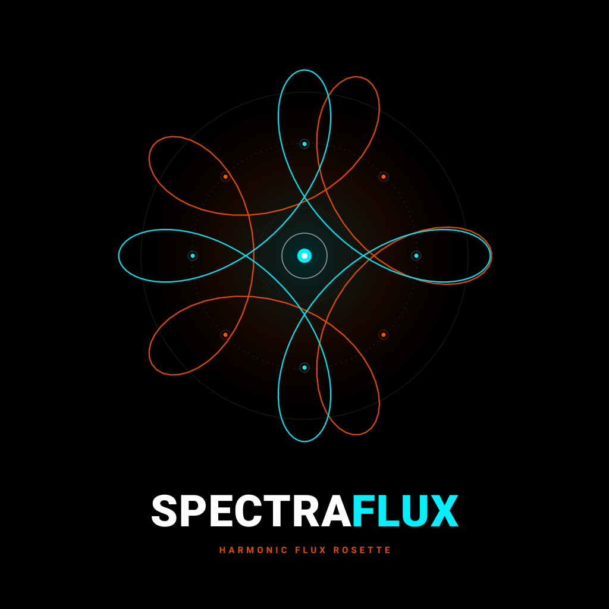

<p align="center">
  
</p>

<p align="center">
  <strong>The High-Velocity Streaming Execution Chassis &amp; WebAssembly Runtime</strong><br>
  <em>Executing sandboxed event-driven Fluxcells with sub-millisecond dispatch and hardware isolation.</em>
</p>

<p align="center">
  <a href="LICENSE"></a>
  <a href="https://www.rust-lang.org/"></a>
  <a href="https://bytecodealliance.org/"></a>
</p>

---

## 1. Architecture Overview

```
┌─────────────────────────────────────────────────────────────────────────────┐
│ SpectraGQL (API Gateway Appliance)                                          │
│   ├── Mode A: Reverse-Proxies Reads                                         │
│   └── Mode B: Emits UUIDv7/HLC Command Receipts & Dispatches to Broker       │
└──────────────────────────────────────┬──────────────────────────────────────┘
                                       │ (NATS / Kafka / Redis Streams)
                                       ▼
┌─────────────────────────────────────────────────────────────────────────────┐
│ SpectraFlux (Downstream Execution Chassis & Worker Appliance)               │
│                                                                             │
│  ┌───────────────────────────────────────────────────────────────────────┐  │
│  │ Wasmtime Execution Engine                                             │  │
│  │   • Epoch Interruption & Preemptive Timeouts                          │  │
│  │   • Circuit Breakers & Adaptive Backoff                               │  │
│  │   • Zero-Copy Multi-Instance Instance Pooling                         │  │
│  └───────────────────────────────────┬───────────────────────────────────┘  │
│                                      ▼                                      │
│  ┌───────────────────────────────────────────────────────────────────────┐  │
│  │ Host Capabilities Bridge (WIT Contract)                               │  │
│  │   • host_db: Multi-Database Connection Pooling (deadpool-postgres)    │  │
│  │   • kv_store: Embedded Kevy / Redis key-value operations             │  │
│  │   • host_broker: Outbound topic dispatching                           │  │
│  └───────────────────────────────────┬───────────────────────────────────┘  │
│                                      ▼                                      │
│  ┌───────────────────────────────────────────────────────────────────────┐  │
│  │ Dynamic WebAssembly Fluxcells (Sandboxed Micro-Units)                 │  │
│  │   • magic-link, webhook, custom guest cells                           │  │
│  │   • Authoring via fluxcell-sdk (Rust) and @spectraflux/sdk (TS)       │  │
│  └───────────────────────────────────────────────────────────────────────┘  │
└─────────────────────────────────────────────────────────────────────────────┘
```

---

## 2. Repository Layout

* **[`wit/fluxcell.wit`](wit/fluxcell.wit)**: Canonical WebAssembly Interface Type (WIT) specification defining host capabilities and guest entrypoints.
* **[`runtime/`](runtime/)**: The `spectra-flux` host runtime execution engine and HTTP router (:8081).
* **[`sdks/`](sdks/)**: Official Guest SDKs for writing WebAssembly Fluxcells:
  * **[`sdks/rust/`](sdks/rust/)**: Canonical Rust guest SDK (`fluxcell-sdk`).
  * **[`sdks/typescript/`](sdks/typescript/)**: Official TypeScript / JavaScript SDK (`@spectraflux/sdk`).
* **[`tools/`](tools/)**: Developer tooling:
  * **[`tools/cli/`](tools/cli/)**: Developer CLI (`fluxcell-cli`).
* **[`seeds/`](seeds/)**: Canonical barebones starter seeds for cloning or scaffolding:
  * **[`seeds/rust/`](seeds/rust/)**: Barebones Rust starter seed (`fluxcell-seed-rs`).
  * **[`seeds/typescript/`](seeds/typescript/)**: Barebones TypeScript starter seed (`fluxcell-seed-ts`).
* **[`examples/`](examples/)**: Feature-complete sample applications:
  * **[`examples/rust/mailer/`](examples/rust/mailer/)**: Asynchronous invoice mailer and webhook dispatcher.
  * **[`examples/typescript/`](examples/typescript/)**: TypeScript sample applications.
* **[`fluxcells/`](fluxcells/)**: Pre-built runtime cells:
  * **[`fluxcells/rust/`](fluxcells/rust/)**: System reference cells (`magic-link`, `webhook`).
  * **[`fluxcells/typescript/`](fluxcells/typescript/)**: System TypeScript cells.

---

## 3. Quick Start: Developing a Fluxcell in Rust

Scaffold instantly via the CLI:
```bash
fluxcell new my-rust-cell --lang rust
```

Or add the SDK to your `Cargo.toml`:

```toml
[dependencies]
fluxcell-sdk = { path = "path/to/SpectraFlux/sdks/rust" }
serde = { version = "1.0", features = ["derive"] }
serde_json = "1.0"
```

Write your Fluxcell with zero unsafe code:

```rust
use fluxcell_sdk::prelude::*;

struct MyCell;

impl Fluxcell for MyCell {
    fn metadata() -> FluxcellMetadata {
        FluxcellMetadata::new("0.1.0", "My Custom Fluxcell")
    }

    fn routes() -> Vec<RouteMeta> {
        vec![RouteMeta::post("/mutate", "Execute transactional mutation")]
    }

    fn handle_http(req: HttpRequest) -> HttpResponse {
        if req.path == "/mutate" {
            // 1. Acquire transaction from host database pool
            let mut tx = match Database::default().begin_tx() {
                Ok(t) => t,
                Err(e) => return HttpResponse::error(e),
            };

            // 2. Execute SQL inside transaction
            if let Err(e) = tx.execute("INSERT INTO items (name) VALUES ($1)", &serde_json::json!(["Widget"])) {
                return HttpResponse::error(e);
            }

            // 3. Commit (uncommitted transactions auto-rollback on Drop)
            if let Err(e) = tx.commit() {
                return HttpResponse::error(e);
            }

            return HttpResponse::json(&serde_json::json!({ "status": "COMMITTED" }));
        }

        HttpResponse::not_found("Endpoint not found")
    }
}

export_fluxcell!(MyCell);
```

---

## 4. Quick Start: Developing a Fluxcell in TypeScript

Scaffold instantly via the CLI:
```bash
fluxcell new my-ts-cell --lang ts
```

Or use the TypeScript SDK directly:
```bash
cd seeds/typescript
bun install
bun run build
bun test
```

Write your Fluxcell in AssemblyScript / TypeScript:

```typescript
import {
  Fluxcell,
  FluxcellMetadata,
  HttpRequest,
  HttpResponse,
  RouteMeta,
  registerFluxcell,
} from "@spectraflux/sdk/assembly/index";

export class MyTsCell extends Fluxcell {
  metadata(): FluxcellMetadata {
    return new FluxcellMetadata("0.1.0", "My TypeScript Fluxcell");
  }

  routes(): RouteMeta[] {
    return [
      RouteMeta.get("/health", "Health check endpoint"),
      RouteMeta.post("/mutate", "Transactional mutation"),
    ];
  }

  handleHttp(req: HttpRequest): HttpResponse {
    if (req.path == "/health") {
      return HttpResponse.json('{"status":"healthy"}');
    }
    return HttpResponse.notFound("Endpoint not found");
  }
}

registerFluxcell(new MyTsCell());

// Re-export C-ABI functions for the SpectraFlux Wasmtime host
export {
  allocate,
  deallocate,
  get_metadata,
  get_subscriptions,
  get_routes,
  handle_http,
  handle_event,
} from "@spectraflux/sdk/assembly/index";
```

---

## 5. Building and Testing

```bash
# Run Rust tests across entire workspace
cargo test --workspace

# Build the chassis binary
cargo build --package spectra-flux --release

# Build & test TypeScript SDK and Seed
cd seeds/typescript
bun run build
bun test
```

